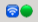
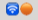
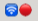
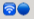
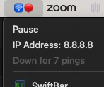

# swiftbar-ping

SwiftBar Ping is a plugin for SwiftBar to ping an IP and alert if the ping fails.

## Installation

If you have SwiftBar already installed and running, jump to step 3.

1. Install [SwiftBar](https://github.com/swiftbar/SwiftBar) if it's not already installed: `brew install swiftbar`
2. Run Swiftbar and set your plugins directory
3. Save [ping-status.1s.js](./ping-status.1s.js) to your plugins directory

## Usage

When running, the plugin will ping the configured IP once per second. The IP defaults to 8.8.8.8 and is a constant in the script code which you can change if you need to.

The display has 4 states:

-  Online
-  First 1-3 Fails
-  Offline
-  Paused

If pinging fails, it enters the warning state (orange) and if it continues to fail more than 3 times in a row, it enters the offline state (red). Once connectivity is restored, it enters the online state again (green).

Click on the state icon to drop down the menu and you'll see 3 things specific to this plugin:

1. Pause/Run toggle - Click this to toggle between running and paused
2. The IP address set to be pinged
3. A failed ping count to give an idea of how long you've been without a stable connection

## Other Notes

Failure counts and running status are stored in state files in /tmp. If something isn't working run `ls -la /tmp/ping-status*` to check that you have `ping-status-failureCount.txt` and
`ping-status-isRunning.txt`

If the need becomes apparent, a future version might read the IP address and other configurations from a json file, but it's pretty basic for now.